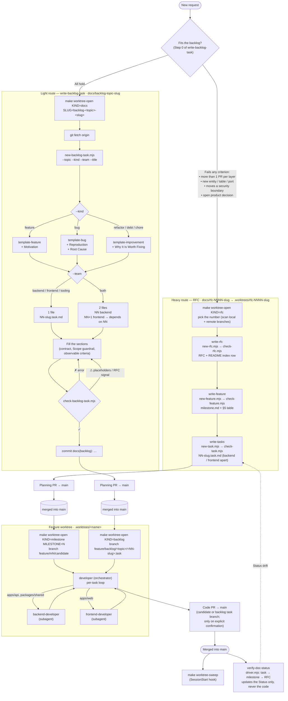
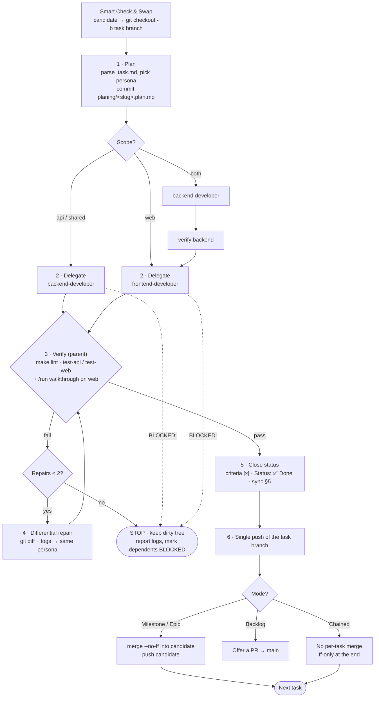

# ArenaQuest skills — how they fit together

Visual map of the project skills in this folder. Each skill's `SKILL.md` is the
source of truth; this page only summarises how they hand work to one another.
**When a `SKILL.md` changes a step, update the matching diagram in the same PR.**

| Skill | Role |
|---|---|
| [`write-rfc`](./write-rfc/SKILL.md) | Scaffold and validate an RFC (`new-rfc.mjs` → `check-rfc.mjs`) |
| [`write-feature`](./write-feature/SKILL.md) | Derive a milestone from an RFC (`new-feature.mjs` → `check-feature.mjs`) |
| [`write-backlog-task`](./write-backlog-task/SKILL.md) | Light route: Step 0 gate, then one or two backlog `.task.md` files with no RFC (`new-backlog-task.mjs` → `check-backlog-task.mjs`) |
| [`write-tasks`](./write-tasks/SKILL.md) | Break a milestone into `NN-<slug>.task.md` files (`new-task.mjs` → `check-task.mjs`) |
| [`developer`](./developer/SKILL.md) | Orchestrate task delivery: branches, plan, delegate, verify, commit, merge |
| [`backend-developer`](./backend-developer/SKILL.md) | Implement `apps/api` / `packages/shared` work (usually as a subagent) |
| [`frontend-developer`](./frontend-developer/SKILL.md) | Implement `apps/web` work (usually as a subagent) |
| [`verify-doc-status`](./verify-doc-status/SKILL.md) | Reconcile doc statuses with the implementation (`driver.mjs`); never edits code |

## 1. End to end: from a request to delivery

Every request first passes the **Step 0** gate of `write-backlog-task`. If it fails
any criterion it takes the **heavy route** (RFC → milestone → tasks); otherwise the
**light route** (one or two backlog task files). Both ship their planning in a
docs-only PR before `developer` executes it.

## 2. The `developer` per-task loop

## Rules the diagrams encode

- **The parent owns every observable step.** `developer` runs branches,
  verification, commits, pushes, merges and status edits; persona subagents only
  write code and commit locally.
- **`main` is PR-only.** Nothing is committed, merged or pushed to `main`
  directly; a PR is opened only on explicit confirmation.
- **Planning ships before code.** Both routes — the RFC → milestone → task chain and
  the backlog task files — merge through their own docs PR before the feature
  worktree is opened.
- **Step 0 decides the route.** A request that fails any backlog criterion becomes
  an RFC; the gate names the failed criterion instead of deciding silently.
- **`verify-doc-status` is report-only on code.** It points at what is missing;
  it never changes implementation to make a criterion pass.
