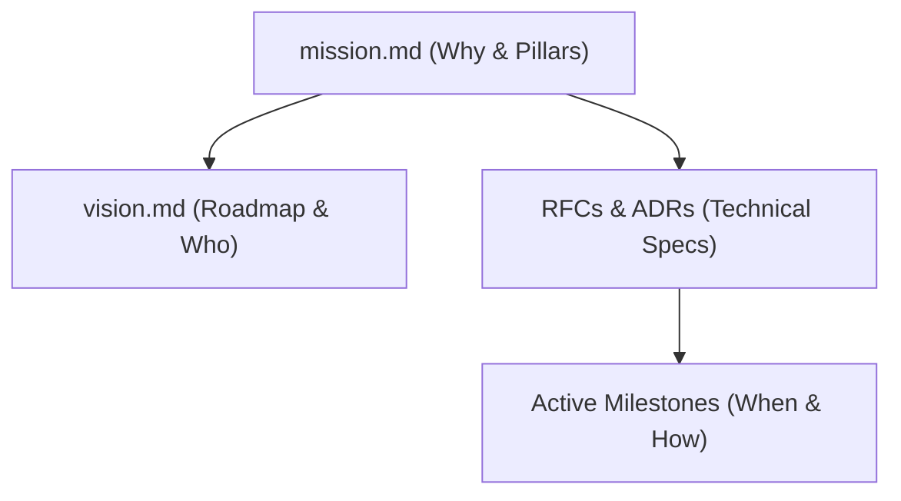

# **ArenaQuest: Project Mission & Mandates**

Welcome to the **ArenaQuest** core mission and design mandate document. This serves as the stable, evergreen "North Star" for all product development, technical architecture decisions, and AI agent execution policies.

---

## **1. Core Mission**

ArenaQuest is an open-source, cloud-agnostic platform designed to gamify physical activities, learning paths, and sports engagement. 

Our core purpose is to **bridge the gap between physical or educational effort and digital rewards**, providing a centralized hub for knowledge management, progress tracking, and structured user journeys.

---

## **2. Core Product Pillars**

The ArenaQuest ecosystem is built upon four fundamental product pillars:

### **Pillar I: Hierarchical Content & Node Management**
* **Unified Tree Structure:** The platform treats topics and subtopics identically as "Nodes" in a tree. Any parent node can have child nodes, inheriting properties and forming flexible, deep learning or training pathways.
* **Rich Media Integration:** Each node supports multiple media types (Markdown, PDFs, and embedded video) alongside rich metadata (authors, time estimates, tags, prerequisites).

### **Pillar II: Gamified Engagement Engine**
* **Interdisciplinary Tasks:** Challenges and tasks can link to multiple nodes/topics simultaneously to encourage holistic progress.
* **Completion Gates (Stages):** Progress is structured through sequential validation steps (e.g., *1. Reading*, *2. Practice*, *3. Peer Review*, *4. Completion*).
* **Rewards Integration:** Foundation designed to integrate badge allocations, XP, and progress-based rewards.

### **Pillar III: Participant Portal**
* **Progress Tracking:** A sleek dashboard featuring visual progress bars, interactive radial charts, and intuitive completion logs.
* **Fluid Experience:** Fast, responsive interfaces optimized for focus, media consumption, and quick check-ins on tasks.

### **Pillar IV: Backoffice Administration**
* **Role-Based Access Control (RBAC):** Strict permissions dividing system control (Admin, Content Creator, Tutor, Student).
* **Allocation Engine:** Quick enrollment of members into specific topics or path releases.
* **Analytics & Bottlenecks:** Real-time visibility into student performance and bottlenecks.

---

## **3. Non-Negotiable Engineering Principles**

Every piece of code and every task designed for ArenaQuest must respect these foundational constraints:

### **I. 100% Cloud-Agnosticism**
* **The Ports & Adapters (Hexagonal) Architecture** is strictly mandatory. 
* Business logic layer (core packages) must remain pure and free from cloud provider-specific SDKs (like `aws-sdk`, Cloudflare-specific dependencies, etc.).
* All persistence, storage, and identity services must be accessed through abstract interfaces (Ports) and implemented via swappable Adapters.

### **II. Performance & Modern Stack**
* The stack relies on **Next.js**, **React**, **Vanilla CSS** (for maximum design control), and lightweight **Cloudflare Workers**. 
* Deployment-friendly architectures (Edge/Serverless) must be preferred, keeping footprint small and operations ultra-fast.

---

## **4. Documentation & Governance Architecture**

To maintain clarity and prevent documentation decay, we organize our specs dynamically:

* **Mission (`mission.md`):** This file. Stable, core principles, and non-negotiables.
* **Vision (`vision.md`):** High-level target audience and active roadmap status.
* **RFCs (`docs/product/RFCs/`):** Detailed proposals and specification documents for new features or major system changes.
* **Architecture Guidelines (`docs/architecture/`):** Technical architecture blueprints, conventions, and guidelines (divided into `api/` and `web/`).
* **Milestones (`docs/product/milestones/`):** The ground-truth checklist of active and completed tasks.
